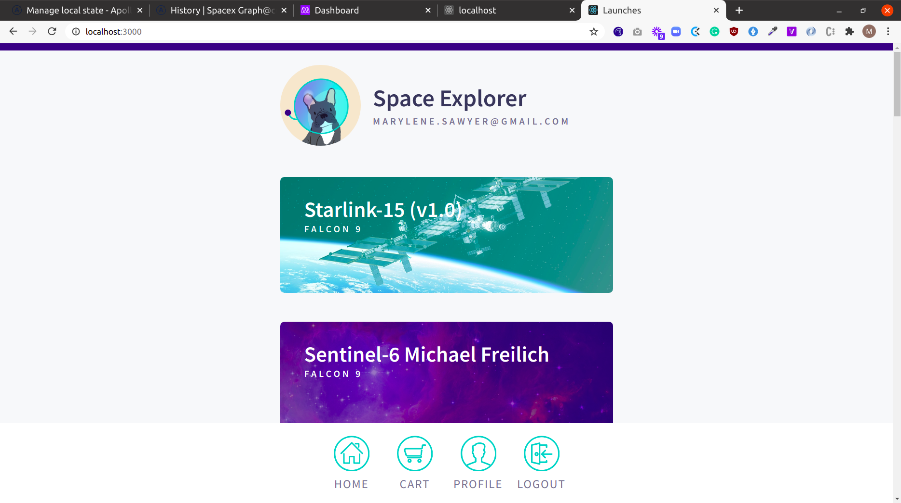

# Apollo tutorial

This is the fullstack app for the [Apollo tutorial](http://apollographql.com/docs/tutorial/introduction.html). 🚀



## File structure

The app is split out into two folders:
- `start`: Starting point for the tutorial
- `final`: Final version

From within the `start` and `final` directories, there are two folders (one for `server` and one for `client`).

[Deployed site](https://fullstack-apollo-spacex-app.herokuapp.com/)

## Installation

To run the app, run these commands in two separate terminal windows from the root:

```bash
cd final/server && npm i && npm start
```

and

```bash
cd final/client && npm i && npm start
```

### Deployment
#### Heroku

- `cd start/client && npm run build`

- `cd start/server/` 
- Initialize git heroku repo accorging to [instructions](https://devcenter.heroku.com/articles/deploying-nodejs)